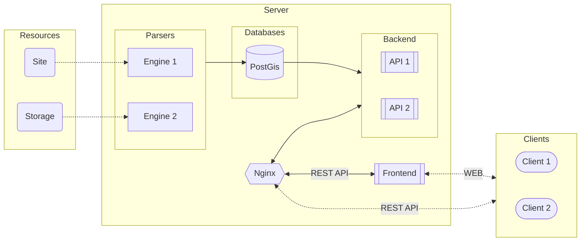

# pred-city-env
[](https://github.com/dsuhoi/pred-city-env/blob/main/LICENSE)
>Сервис по прогнозированию негативных аспектов развития городской среды.


---
## Идея
Сервис предоставляет данные по различным метрикам городов, районов и кварталов,
которые могут быть полезны при оценке благоустройства определенной местности.

## Установка и запуск
Запустите в корневой директории проекта следующую команду:
```bash
docker compose up -d --build
```

Для просмотра карты перейдите по адресу `0.0.0.0:8081`, а для доступа к API - `0.0.0.0:8001`.

## Архитектура

Сервис состоит из четырех основных частей:
- База данных для хранения геоданных (PostGis)
- [Backend](#backend)
- [Frontend](#frontend)
- [Pipeline](#pipeline)
---
### Backend
#### Описание
В качестве основного фреймворка был выбран `FastAPI`. Для взаимодействия с
PostGis используется `SQLAlchemy` (`GeoAlchemy`). Аутентификация пользователей осуществляется с помощью JWT.

Сервис разделен на три основные части:
- Система авторизации пользователей
- Система для поиска геоданных
- Доп. функционал


### Frontend
#### Описание
Frontend сервиса отображает города и районы на карте,
также указывая на ней тепловую карту признаков основных метрик.

В качестве фреймворка использовался `streamlit`, а для визуализации компонентов
карты пакет `folium`.

### Pipeline
#### Описание
Pipeline сервиса вычисляет индекс благополучия района.

В качестве основных инструментов использовался `osmnx` для парсинга данных из osm, для обработки данных использовался `[geo]pandas`.

---

## License
This project is [MIT](https://github.com/dsuhoi/pred-city-env/blob/main/LICENSE) licensed.
